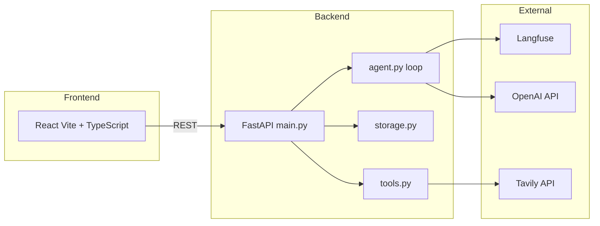
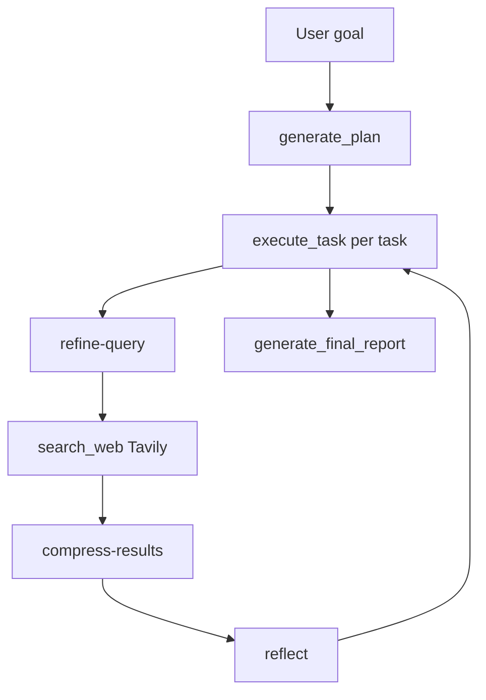

# LexAgent — Legal Research AI Agent

A legal research AI agent that takes a research goal, breaks it into actionable tasks, executes them using real web search tools, and produces a structured markdown report.

**Live demo:** [lexagent-production.up.railway.app](https://lexagent-production.up.railway.app) | **Repo:** [github.com/niranjanxprt/Lexagent](https://github.com/niranjanxprt/Lexagent)

### Project background

This started as a weekend prototype to see how far a manual agent loop could get on real legal research without framework overhead. The design — compressed context notes and Langfuse-versioned prompts — emerged from iterating on context size and Tavily query specificity. PDF ingestion and RAG were deliberately excluded for now.

## Features

- **Agent Loop** — Built manually (no LangChain, LangGraph, AutoGen, or CrewAI)
- **Context Compression** — Raw search results are never stored; only 2–3 sentence summaries are retained
- **Langfuse Observability** — Full tracing of every LLM call (optional; prompts are in code as fallback if unreachable)
- **Persistent Sessions** — Resume research sessions from past runs
- **Markdown Reports** — Professional legal research reports saved to disk
- **React Frontend** — Modern UI (Vite + TypeScript)

---

## Prerequisites

- Python 3.11+, Node.js 18+, [UV](https://docs.astral.sh/uv/)
- API keys in `.env`: `OPENAI_API_KEY`, `TAVILY_API_KEY` (Langfuse keys optional)

---

## Quick Start

1. **Clone and setup**
   ```bash
   git clone https://github.com/niranjanxprt/Lexagent.git
   cd Lexagent
   make setup
   ```
   Add your `OPENAI_API_KEY` and `TAVILY_API_KEY` to `.env`.

2. **Run**
   ```bash
   make run
   ```
   Backend: http://localhost:8000 · React: http://localhost:5173 · API docs: http://localhost:8000/docs

Docker: see [docs/DEPLOYMENT.md](docs/DEPLOYMENT.md).

---

## Architecture

### System components



### Agent loop



Details: [docs/ARCHITECTURE.md](docs/ARCHITECTURE.md).

---

## API Endpoints

| Method | Endpoint | Description |
|--------|----------|-------------|
| GET | `/health` | Health check |
| POST | `/agent/start` | Create session, generate plan |
| GET | `/agent/{id}` | Get session state |
| GET | `/agent/{id}/report` | Get report markdown |
| POST | `/agent/{id}/execute` | Execute next task |
| GET | `/sessions` | List all sessions |
| DELETE | `/agent/{id}` | Delete session |

Interactive docs: http://localhost:8000/docs

---

## Development

`make help` — list all commands. Tests and linting: [docs/TESTING.md](docs/TESTING.md).

---

## Documentation

| Document | Description |
|----------|-------------|
| [docs/ARCHITECTURE.md](docs/ARCHITECTURE.md) | System architecture, agent loop, deployment |
| [docs/TESTING.md](docs/TESTING.md) | Testing guide (Python + React) |
| [docs/EVALUATION.md](docs/EVALUATION.md) | Evaluation design and criteria |
| [docs/DEPLOYMENT.md](docs/DEPLOYMENT.md) | Deployment (Railway, Docker) |
| [docs/LANGFUSE_SETUP.md](docs/LANGFUSE_SETUP.md) | Langfuse prompt management |
| [docs/SECURITY.md](docs/SECURITY.md) | Security guardrails |
| [docs/BEST_PRACTICES.md](docs/BEST_PRACTICES.md) | Best practices |
| [transcript.md](transcript.md) | Example session transcript |
| [frontend-react/README.md](frontend-react/README.md) | React frontend details |

---

## Evaluation

See [docs/EVALUATION.md](docs/EVALUATION.md).

---

## Known limitations

- **Security:** Queries with instruction-override or jailbreak-style wording may be blocked; use neutral legal language.
- **Retry:** Tavily retries with backoff; OpenAI timeouts fail the current task; session stays resumable.
- **Context:** `context_notes` truncated at 8k/12k chars for long sessions.

## License

MIT
