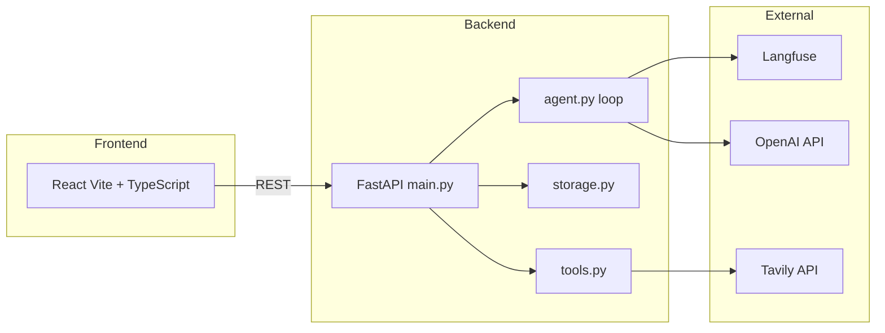
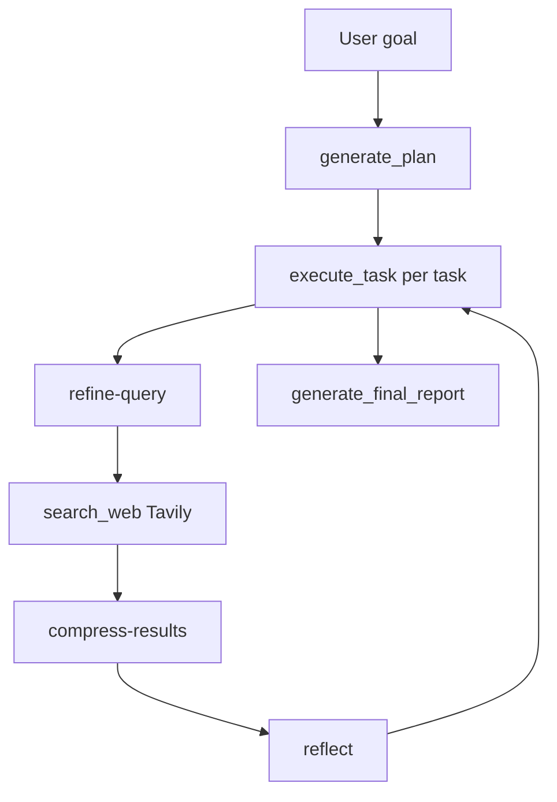

# LexAgent — Legal Research AI Agent

A legal research AI agent that takes a research goal, breaks it into actionable tasks, executes them using real web search (Tavily), and produces a structured markdown report. You get a plan, stepwise execution with compressed context, and a final report with sources — no framework stack, just a manual agent loop and observability via Langfuse.

**Live demo:** [lexagent-production.up.railway.app](https://lexagent-production.up.railway.app) | **Repo:** [github.com/niranjanxprt/Lexagent](https://github.com/niranjanxprt/Lexagent)

### Background

This started as a weekend prototype to see how far a minimal agent loop could get on real legal research. The current design — compressed context notes and Langfuse-versioned prompts — came from iterating on token budgets and search specificity. PDF ingestion and RAG are natural next steps; they were left out initially so the core loop could ship without half-finished extras.

## Features

- **Agent Loop** — Built manually (no LangChain, LangGraph, AutoGen, or CrewAI)
- **Context Compression** — Raw search results are never stored; only 2–3 sentence summaries are retained
- **Langfuse Observability** — Full tracing of every LLM call (optional; prompts are in code as fallback if unreachable)
- **Persistent Sessions** — Resume research sessions from past runs
- **Markdown Reports** — Professional legal research reports saved to disk
- **React Frontend** — Modern UI (Vite + TypeScript)

---

## Prerequisites

- Python 3.11+, Node.js 18+, [UV](https://docs.astral.sh/uv/)
- API keys in `.env`: `OPENAI_API_KEY`, `TAVILY_API_KEY` (Langfuse keys optional)

---

## Quick Start

Local run uses **make** only (no Docker required). Docker is used for deployment (e.g. Railway).

1. **Clone and setup**
   ```bash
   git clone https://github.com/niranjanxprt/Lexagent.git
   cd Lexagent
   make setup
   ```
   Add your `OPENAI_API_KEY` and `TAVILY_API_KEY` to `.env`.

2. **Run**
   ```bash
   make run
   ```
   Backend: http://localhost:8000 · React: http://localhost:5173 · API docs: http://localhost:8000/docs

Deploy (Railway or Docker): [docs/DEPLOYMENT.md](docs/DEPLOYMENT.md). For local development you don’t need Docker; the Makefile handles install and run.

---

## Architecture

### System components



### Agent loop



The loop: plan (decompose goal into tasks) → for each task, refine query → search → compress results → reflect (fully/partially/not addressed) → repeat or generate report. Full data flow and modules: [docs/ARCHITECTURE.md](docs/ARCHITECTURE.md).

### Prompts and model use

Five prompts drive the agent. **gpt-4.1** (full) is used for the two high-stakes steps that need deeper reasoning; **gpt-4.1-mini** is used for the high-frequency, narrower steps to keep cost and latency down. The base model is set by `OPENAI_MODEL` (default `gpt-4.1-mini`); the full model is derived by stripping the `-mini` suffix (e.g. `gpt-4.1-mini` → `gpt-4.1`).

| Prompt | Model | Why it’s used |
|--------|--------|----------------|
| **generate-plan** | gpt-4.1 | Decomposes the research goal into 5–7 web-searchable tasks. Needs to cover primary law, guidance, case law, jurisdiction, and compliance without duplicating source types. |
| **refine-query** | gpt-4.1-mini | Turns one task into a single web search query (max ~18 words). Narrow job: jurisdiction + instrument + topic + optional article/section. |
| **compress-results** | gpt-4.1-mini | Summarizes raw Tavily results into 2–4 sentences for the memo. Sees only the raw search output (no prior context), so the model can’t rubber-stamp; it must ground the summary in the results. |
| **reflect** | gpt-4.1-mini | Decides whether the task is fully addressed, partially addressed, or not addressed and returns a short “gap” string. Output is small, structured JSON; used to decide whether to run another search or move on. |
| **generate-report** | gpt-4.1 | Synthesizes the final Markdown report from all task summaries and context notes. High-stakes: citations and structure must be correct and grounded in the research. |

---

## API Endpoints

| Method | Endpoint | Description |
|--------|----------|-------------|
| GET | `/health` | Health check |
| POST | `/agent/start` | Create session, generate plan |
| GET | `/agent/{id}` | Get session state |
| GET | `/agent/{id}/report` | Get report markdown |
| POST | `/agent/{id}/execute` | Execute next task |
| GET | `/sessions` | List all sessions |
| DELETE | `/agent/{id}` | Delete session |

Interactive docs: http://localhost:8000/docs

---

## Development

Run `make help` for all targets. Common: `make test` (Python), `make react-test` (frontend), `make lint`. See [docs/TESTING.md](docs/TESTING.md) for the full testing guide.

---

## Documentation

| Document | Description |
|----------|-------------|
| [docs/ARCHITECTURE.md](docs/ARCHITECTURE.md) | System architecture, agent loop, deployment |
| [docs/TESTING.md](docs/TESTING.md) | Testing guide (Python + React) |
| [docs/EVALUATION.md](docs/EVALUATION.md) | Evaluation design and criteria |
| [docs/DEPLOYMENT.md](docs/DEPLOYMENT.md) | Deploy to Railway or run with Docker |
| [docs/LANGFUSE_SETUP.md](docs/LANGFUSE_SETUP.md) | Langfuse prompt management |
| [docs/SECURITY.md](docs/SECURITY.md) | Security guardrails |
| [docs/BEST_PRACTICES.md](docs/BEST_PRACTICES.md) | Best practices |
| [transcript.md](transcript.md) | Example session transcript |
| [frontend-react/README.md](frontend-react/README.md) | React frontend details |

---

## Evaluation

E2E pipeline checks, reflect prompt tests, and LLM-as-judge setup are in [docs/EVALUATION.md](docs/EVALUATION.md).

---

## What’s next

Planned directions (not in this repo yet): **RAG and PDF ingestion** (ingest contracts, regulations, or case law and ground answers in your corpus), rate limiting and auth for the API, optional database backend for sessions, and stronger retries for transient failures. The current design keeps the loop small and shippable so these can be added without rewriting the agent.

## License

MIT
