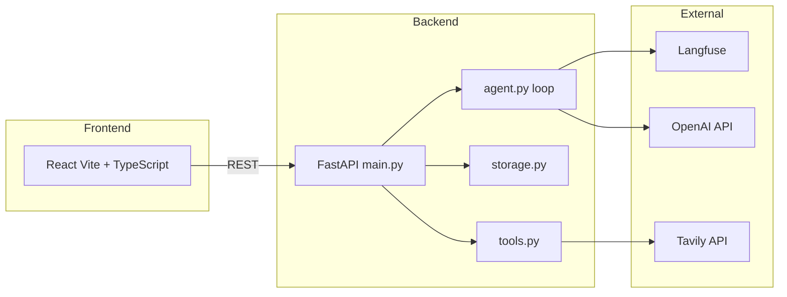
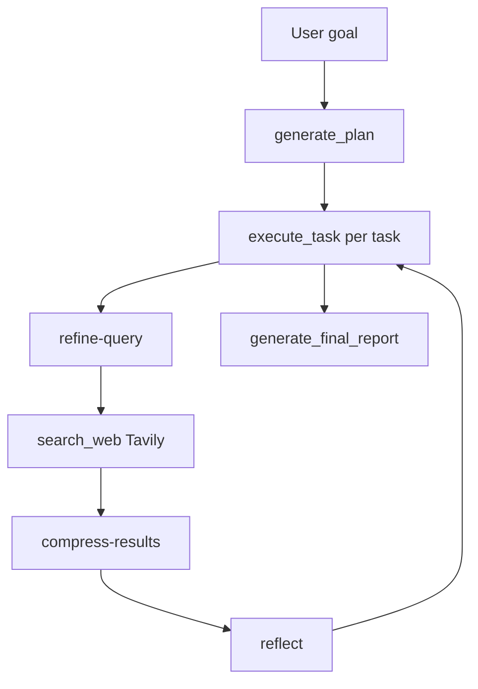

# LexAgent — Legal Research AI Agent

A legal research AI agent that takes a research goal, breaks it into actionable tasks, executes them using real web search tools, and produces a structured markdown report.

**Live demo:** [lexagent-production.up.railway.app](https://lexagent-production.up.railway.app) | **Repo:** [github.com/niranjanxprt/Lexagent](https://github.com/niranjanxprt/Lexagent)

### Project background

This started as a weekend prototype to see how far a manual agent loop could get on real legal research without framework overhead. The main challenges were: (1) keeping context small enough to stay within token budgets across multiple tasks, and (2) making Tavily queries specific enough to get regulation-level detail. The current design — compressed context notes and Langfuse-versioned prompts — emerged from iterating on both. PDF ingestion and RAG were deliberately excluded; they are the obvious next layer but shipping them half-finished would make the demo worse, not better.

## Features

- **Agent Loop** — Built manually (no LangChain, LangGraph, AutoGen, or CrewAI)
- **Context Compression** — Raw search results are never stored; only 2–3 sentence summaries are retained
- **Langfuse Observability** — Full tracing of every LLM call with token usage and latency
- **Persistent Sessions** — Resume research sessions from past runs
- **Markdown Reports** — Professional legal research reports saved to disk
- **React Frontend** — Modern UI (Vite + TypeScript)

---

## Prerequisites

- Python 3.11+
- **Either** [UV](https://docs.astral.sh/uv/) **or** venv + pip (see Quick Start below)
- Node.js 18+ (for React frontend only)
- API keys: OpenAI, Tavily; Langfuse recommended for tracing (agent falls back to inline prompts if unreachable)

---

## Quick Start

You can use **UV** (default) or **venv + pip**; both work with the same `requirements.txt`. We keep a single toolchain (UV or pip) to avoid extra complexity; Poetry is not required.

### Option A — UV (recommended)

#### 1. Clone and install

```bash
git clone https://github.com/niranjanxprt/Lexagent.git
cd Lexagent
uv sync
```

#### 2. Configure environment

```bash
cp .env.example .env
```

Edit `.env` with your API keys:

```
OPENAI_API_KEY=sk-...
TAVILY_API_KEY=tvly-...
LANGFUSE_SECRET_KEY=sk-lf-...   # Optional
LANGFUSE_PUBLIC_KEY=pk-lf-...  # Optional
LEXAGENT_API_URL=http://localhost:8000
OPENAI_MODEL=gpt-4.1-mini
```

#### 3. Initialize Langfuse prompts (if using Langfuse)

```bash
uv run python app/init_langfuse_prompts.py
```

#### 4. Run the application

**Terminal 1 — Backend**

```bash
make backend
# or: uv run uvicorn app.main:app --reload --port 8000
```

**Terminal 2 — Frontend**

```bash
make react
# UI: http://localhost:5173
```

---

### Option B — venv + pip

Use this if you prefer standard Python venv and pip (no UV installed).

#### 1. Clone and create venv

```bash
git clone https://github.com/niranjanxprt/Lexagent.git
cd Lexagent
python3 -m venv .venv
```

**Activate the venv:**

- macOS/Linux: `source .venv/bin/activate`
- Windows (cmd): `.venv\Scripts\activate.bat`
- Windows (PowerShell): `.venv\Scripts\Activate.ps1`

#### 2. Install dependencies

```bash
pip install -r requirements.txt
```

#### 3. Configure environment

```bash
cp .env.example .env
```

Edit `.env` with your API keys (same as in Option A).

#### 4. Initialize Langfuse prompts (if using Langfuse)

```bash
python app/init_langfuse_prompts.py
```

#### 5. Run the application

**Terminal 1 — Backend**

```bash
uvicorn app.main:app --reload --port 8000
```

**Terminal 2 — Frontend**

```bash
cd frontend-react && npm install && npm run dev
# UI: http://localhost:5173
```

*Note: The Makefile uses `uv run`; for a pip-only setup use the commands above (no `make` required).*

### Local Docker (API + React)

The backend image **includes** the React app (built at image build time). One container serves both.

```bash
docker compose up --build backend
```

- **http://localhost:8000** — React UI and API (same as Railway)
- Ensure `.env` contains `OPENAI_API_KEY` and `TAVILY_API_KEY`

Optional: `docker compose up --build` also starts a separate React container on port 3000; both work. The backend alone is sufficient for local testing.

Sessions and reports persist when you mount volumes (default: `./data`, `./reports`). Same setup without Docker: `make backend` and `make react` (or `make dev`).

The agent loop, context compression, prompt rationale, and failure resilience are documented in [docs/ARCHITECTURE.md](docs/ARCHITECTURE.md).

## Architecture

### System components



### Agent loop



High-level layout and design are documented in [docs/ARCHITECTURE.md](docs/ARCHITECTURE.md) (data models, prompt architecture, deployment). Key modules: `agent.py` (loop), `main.py` (HTTP), `storage.py` (JSON persistence), `tools.py` (Tavily + report writer), `security.py` (input validation).

---

## API Endpoints

| Method | Endpoint | Description |
|--------|----------|-------------|
| GET | `/health` | Health check |
| POST | `/agent/start` | Create session, generate plan |
| GET | `/agent/{id}` | Get session state |
| GET | `/agent/{id}/report` | Get report markdown |
| POST | `/agent/{id}/execute` | Execute next task |
| GET | `/sessions` | List all sessions |
| DELETE | `/agent/{id}` | Delete session |

---

## Development

### Commands

```bash
make help          # List all commands
make test          # Python backend tests
make react-test    # React frontend tests
make test-all      # All tests
make lint          # Ruff linter
make lint-fix      # Auto-fix lint issues
make react-build   # Build React for production
make clean         # Remove sessions and reports
```

### Linting

```bash
uv run ruff check app/
uv run ruff check --fix app/
```

---

## Observability and prompt management

Every session produces a trace in Langfuse: per-task sub-spans, token usage, latency, and the prompt version used for each generation. **Prompt workflow:** edit in Langfuse UI → save → apply `production` label; the running app picks up changes within the SDK cache TTL (~60s). **Fallback:** if Langfuse is unreachable, the agent uses inline prompt copies in `app/agent.py` so it never fails solely due to observability.

**Model split:** Complex reasoning steps use **gpt-4.1** (full model) — `generate-plan` (decomposing the goal into tasks) and `generate-report` (synthesizing the final Markdown report). Simpler, high-frequency steps use **gpt-4.1-mini** — `refine-query`, `compress-results`, and `reflect`. This balances quality where it matters against cost and latency. Controlled by a single env var `OPENAI_MODEL`; `_full_model()` in `app/agent.py` derives the full model by stripping the `-mini` suffix.

## Documentation

| Document | Description |
|----------|-------------|
| [docs/ARCHITECTURE.md](docs/ARCHITECTURE.md) | System architecture, agent loop, data models, deployment topology |
| [docs/TESTING.md](docs/TESTING.md) | Testing guide (Python + React) |
| [docs/EVALUATION.md](docs/EVALUATION.md) | Evaluation design and per-scenario criteria |
| [docs/DEPLOYMENT.md](docs/DEPLOYMENT.md) | Deployment (Railway, Docker, local; includes CLI quick reference) |
| [docs/LANGFUSE_SETUP.md](docs/LANGFUSE_SETUP.md) | Langfuse prompt management |
| [docs/LEGAL_RESEARCH_PROMPTS_V4.md](docs/LEGAL_RESEARCH_PROMPTS_V4.md) | All 5 legal-research prompts (V4) in one file |
| [docs/SECURITY.md](docs/SECURITY.md) | Security guardrails |
| [docs/BEST_PRACTICES.md](docs/BEST_PRACTICES.md) | Development best practices |
| [transcript.md](transcript.md) | Example session transcript |
| [frontend-react/README.md](frontend-react/README.md) | React frontend details |

---

## Evaluation

The system uses a 3-tier eval strategy. Full details, checklists, and LLM-as-judge setup: [docs/EVALUATION.md](docs/EVALUATION.md).

### Tier 1 — E2E pipeline regression (no Langfuse required)

`scripts/run_simple_eval.py` runs the full pipeline (plan → execute all tasks → generate report) against 3 real legal goals from `scripts/eval_dataset.json` and checks each report for required keywords.

```bash
uv run python scripts/run_simple_eval.py          # all 3 goals
uv run python scripts/run_simple_eval.py --limit 1 # quick smoke test
```

| Goal | Required keywords |
|------|------------------|
| GDPR requirements for AI in Germany | `GDPR`, `Article`, `BDSG` |
| EU AI Act obligations for high-risk AI | `AI Act`, `high-risk`, `Article` |
| Employee monitoring data protection in Germany | `BDSG`, `data protection`, `employee` |

**Pass:** all keywords present in generated report. **Fail:** any keyword missing or pipeline error. This is the single most useful validation after prompt or code changes.

### Tier 2 — Reflect prompt unit test (requires Langfuse)

`scripts/run_eval.py` tests only the `reflect` prompt against 3 golden examples in the Langfuse dataset `lexagent-eval-v1`. Scoring is strict: **1.0** if the JSON status field matches exactly, **0.0** otherwise.

```bash
# Create dataset first (once only):
uv run python scripts/create_eval_dataset.py
# Then run eval:
uv run python scripts/run_eval.py
```

| Dataset item | Input type | Expected status |
|---|---|---|
| `reflect-fully-addressed` | GDPR Article 5 with source | `fully_addressed` |
| `reflect-partially-addressed` | GDPR Article 5, no enforcement cases | `partially_addressed` |
| `reflect-no-results` | Empty findings | `not_addressed` |

Scores are posted to Langfuse under **Datasets → lexagent-eval-v1 → reflect-eval-v1**. Threshold: average ≥ 0.8.

### Tier 3 — LLM-as-judge (requires Langfuse)

`scripts/run_eval_llm_judge.py` runs the same reflect items but scores semantically using both `gpt-4.1` and `gpt-4.1-mini` as judges (0.0–1.0). Partial credit for correct status but weak gap. Threshold: average ≥ 0.7 per judge.

```bash
uv run python scripts/run_eval_llm_judge.py
```

### Langfuse state (verified)

All 5 prompts are live under `legal-research/` with `production` label. Dataset `lexagent-eval-v1` has 4 items (3 reflect + 1 plan). Prompt versions and eval runs are visible in the Langfuse dashboard.

## Evaluation scenarios

Success criteria for each scenario: the final report must cite the listed articles/sections, include at least one primary source URL, and contain no hallucinated references.

1. **GDPR AI Compliance** — Article 5, 25, 32; at least one BDSG reference; ≥3 source URLs; no hallucinated article numbers.
2. **EU AI Act high-risk** — Article 9, 13, 16; provider vs deployer; reference to EUR-Lex or official EU source.
3. **BRAO / AI in legal practice** — §43a BRAO, §2 BRAO, Verschwiegenheitspflicht; AI-assisted vs AI-replacing judgment.
4. **Employee monitoring (BDSG)** — §26 BDSG, Betriebsrat, proportionality.
5. **AI-generated contracts** — BGB §305, §§133/157; absence of specific AI-contract law; human review recommendation.

## AI assistants used in development

- **Claude / Cursor:** Refactoring the execute_task flow into the 4-step pattern (refine → search → compress → reflect); drafting security regex patterns; React component structure. Suggestions to combine compress and reflect into one prompt were rejected — the isolated design prevents the model from rubber-stamping its own output.
- **GitHub Copilot:** Boilerplate for FastAPI endpoints and Pydantic models; test scaffolding.
- **Human oversight:** Agent loop state machine (pending → in_progress → done/failed); decision to set in_progress and save before search; Langfuse prompt versions and production label workflow; security pattern false-positive analysis; all trade-offs documented here and in docs.

## Known limitations

- **Security false positives:** Queries containing instruction-override phrases (e.g. "ignore previous instructions", "you are now"), jailbreak wording, or HTML/script patterns may be blocked; rephrase to neutral legal language (e.g. “obligations of a data processor under GDPR Article 28”).
- **Retry:** Tavily uses 3-attempt retry with backoff; OpenAI timeouts still fail the current task; session stays resumable.
- **Context cap:** `context_notes` is truncated at 8,000 chars in execution and 12,000 in the report for long sessions.

## Future planning

Planned improvements (from prior exploration, not yet merged):

- **Rate limiting** — API rate limits to protect against abuse and control costs.
- **OpenAI retry** — Retry with backoff for task execution (in addition to existing Tavily retry) so transient OpenAI errors don’t fail the current task.
- **Storage locking** — File-based or in-process locking around session read/write for safer concurrent access (e.g. multiple execute-step calls).
- **Sessions pagination** — Paginate `GET /sessions` for deployments with many sessions.
- **Integration tests** — API-level tests (e.g. `tests/test_api.py`) for start, execute, report flows without relying on live LLM/Tavily.
- **Railway hardening** — Deployment tweaks (e.g. `start.sh` robustness, healthcheck) and observability improvements for production.

## License

MIT
